# 🔐 Quantum-Resistant Zero-Knowledge Proofs

**NeaByteLab** | **August 2025** | **Version 1.0.0**

[](https://nodejs.org/)
[](https://www.typescriptlang.org/)
[](https://opensource.org/licenses/Apache-2.0)
[](https://github.com/NeaByteLab/Quantum-ZKP)

> **Research Implementation** - Comprehensive TypeScript library for understanding quantum-resistant zero-knowledge proof protocols. Designed for research, education, and prototyping applications.

## 📋 Overview

A comprehensive TypeScript library implementing quantum-resistant zero-knowledge proof protocols using educational cryptographic concepts. This library provides educational implementations of four major post-quantum cryptography approaches:

- **Hash-Based ZKP**: Hash chain implementations using SHA-256/384/512
- **Lattice-Based ZKP**: Learning With Errors (LWE) implementations for lattice cryptography
- **Multivariate ZKP**: Polynomial system implementations for multivariate cryptography  
- **Hybrid ZKP**: Multi-algorithm approaches for defense-in-depth concepts

## ✨ Key Features

- **🔬 Research Focus**: Comprehensive implementations for understanding cryptographic concepts
- **📚 Detailed Documentation**: Mathematical foundations and security analysis
- **⚡ Performance Benchmarks**: Built-in benchmarking for algorithm comparison
- **🛡️ Security Analysis**: Research-grade security assessments
- **📱 Cross-Platform**: Node.js 22+ (browser support planned)
- **🧪 Prototyping Tools**: Development utilities for testing concepts

## 🏗️ Library Architecture


## 📊 Algorithm Comparison

| Algorithm | Foundation | Research Purpose | Performance Profile |
|-----------|------------|-------------------|-------------------|
| **Hash** | SHA-256/384/512 hash functions | Understanding hash-based cryptography | 1.76ms generation, 1.07ms verification |
| **Lattice** | Learning With Errors (LWE) | Researching lattice cryptography principles | 389.67ms generation, 104.79μs verification |
| **Multivariate** | Multivariate polynomial systems | Studying polynomial cryptography concepts | 377.03μs generation, 17.80μs verification |
| **Hybrid** | Multiple algorithm combination | Researching defense-in-depth concepts | 1.33s generation, 654.66μs verification |

*Performance data based on real benchmarks on Apple M3 Pro hardware*

---

## 🚀 Quick Start

### Installation

```bash
npm install @neabyte/quantum-zkp
```

### Basic Usage

```typescript
import { QuantumZKP } from '@neabyte/quantum-zkp'

// Create a quantum-resistant zero-knowledge proof
const secret = 'my-secret-data'
const zkp = new QuantumZKP()
const proof = zkp.createProof(secret, 'hash')

// Verify the proof
const verificationResult = zkp.verifyProof(proof)
console.log('Proof valid:', verificationResult.isValid) // true
console.log('Verification time:', verificationResult.verificationTime, 'ms')
```

### Advanced Usage

```typescript
import { LatticeZKP, HashZKP, MultivariateZKP, HybridZKP } from '@neabyte/quantum-zkp'

// Hash-based ZKP
const hashProof = HashZKP.createProof(secret, {
  chainLength: 1000
})

// Lattice-based ZKP
const latticeProof = LatticeZKP.createProof(secret, {
  dimension: 256,
  modulus: 2n ** 512n
})

// Multivariate ZKP
const multivariateProof = MultivariateZKP.createProof(secret, {
  variables: 8,
  equations: 12
})

// Hybrid ZKP
const hybridProof = HybridZKP.createProof(secret, {
  algorithms: ['hash', 'lattice'],
  weights: [0.6, 0.4]
})
```

## 🔧 Advanced Features

### Threshold Cryptography

```typescript
// Create distributed proof across multiple parties
const thresholdProof = zkp.createThresholdProof(secret, 3, 'lattice')
console.log('Threshold:', thresholdProof.threshold) // 2
console.log('Parties:', thresholdProof.parties) // 3
```

### Batch Processing

```typescript
// Process multiple proofs efficiently
const secrets = ['secret1', 'secret2', 'secret3', 'secret4']
const proofs = zkp.batchCreateProofs(secrets, 'hash', {
  parallel: true,
  batchSize: 2,
  progressCallback: (progress) => console.log(`Progress: ${progress * 100}%`)
})
```

---

### Performance Benchmarking

```typescript
// Benchmark all algorithms
const benchmarks = zkp.benchmarkAllAlgorithms()
benchmarks.forEach(result => {
  console.log(`${result.algorithm}: ${result.operationsPerSecond} ops/sec`)
})
```

## 🧠 Zero-Knowledge Proof Concepts

### Basic ZKP Flow


### ZKP Properties


### Hash-Based ZKP Flow

```mermaid
flowchart LR
    A[Secret] --> B[Hash Chain]
    B --> C[Commitment]
    C --> D[Challenge]
    
    A --> E[Witness]
    E --> F[Response]
    F --> G[Verification]
    G --> H[Result]
    
    D --> F
    
    subgraph "Research Features"
        I[📊 Hash Chain Concepts]
        J[🔒 Hash Function Security]
        K[⚡ Fast Performance]
    end
    
    style A fill:#ffebee,color:#000000
    style H fill:#e8f5e8,color:#000000
    style I fill:#e3f2fd,color:#000000
    style J fill:#fff3e0,color:#000000
    style K fill:#f3e5f5,color:#000000
```



### Lattice-Based ZKP Flow

```mermaid
%%{init: {'theme': 'base', 'themeVariables': { 'primaryColor': '#ffffff', 'primaryTextColor': '#000000', 'primaryBorderColor': '#000000', 'lineColor': '#000000', 'secondaryColor': '#f8f9fa', 'tertiaryColor': '#ffffff'}}}%%
flowchart LR
    A[Secret] --> B[LWE Problem]
    B --> C[Commitment]
    C --> D[Challenge]
    
    A --> E[Witness]
    E --> F[LWE Solution]
    F --> G[Verification]
    G --> H[Result]
    
    D --> F
    
    subgraph "Research Features"
        I[📊 Lattice Cryptography]
        J[🔒 LWE Hardness Assumption]
        K[⚡ Medium Performance]
    end
    
    style A fill:#ffebee,color:#000000
    style H fill:#e8f5e8,color:#000000
    style I fill:#e3f2fd,color:#000000
    style J fill:#fff3e0,color:#000000
    style K fill:#f3e5f5,color:#000000
```



### Multivariate ZKP Flow

```mermaid
flowchart LR
    A[Secret] --> B[Polynomial System]
    B --> C[Commitment]
    C --> D[Challenge]
    
    A --> E[Witness]
    E --> F[Polynomial Solution]
    F --> G[Verification]
    G --> H[Result]
    
    D --> F
    
    subgraph "Research Features"
        I[📊 Polynomial Cryptography]
        J[🔒 Polynomial System Solving]
        K[⚡ Complex Security]
    end
    
    style A fill:#ffebee,color:#000000
    style H fill:#e8f5e8,color:#000000
    style I fill:#e3f2fd,color:#000000
    style J fill:#fff3e0,color:#000000
    style K fill:#f3e5f5,color:#000000
```



### Hybrid ZKP Flow


---

## 🔬 Research Use Cases

### Blockchain & Web3 Research
```typescript
// Research privacy-preserving transactions
const proof = zkp.createProof(transactionData, 'hash')
// Study how zero-knowledge proofs work in blockchain systems
```

### Identity Management Research
```typescript
// Research identity proof concepts
const identityProof = zkp.createProof(userCredentials, 'lattice')
// Study anonymous authentication concepts
```

### IoT Security Research
```typescript
// Research lightweight authentication concepts
const deviceProof = HashZKP.createProof(deviceSecret)
// Study device-to-device communication concepts
```

### Financial Security Research
```typescript
// Research digital signature concepts
const signature = HybridZKP.createProof(financialDocument)
// Study long-term document security concepts
```

---

## ⚡ Performance Characteristics

For detailed performance analysis and optimization recommendations, see [PERFORMANCE.md](./PERFORMANCE.md).

### Algorithm Performance (Real Benchmarks)

| Algorithm | Generation Time | Verification Time | Proof Size | Memory Usage | Ops/sec |
|-----------|----------------|-------------------|------------|--------------|---------|
| Hash | 1.76ms | 1.07ms | 416.18 KB | ~256 KB | 569.1 |
| Lattice | 389.67ms | 104.79μs | 5.01 KB | ~512 KB | 2.6 |
| Multivariate | 377.03μs | 17.80μs | 9.26 KB | 255.9 KB | 2652.3 |
| Hybrid | 1.33s | 654.66μs | 431.54 KB | ~1 MB | 0.7 |

*Benchmark results from Apple M3 Pro with Node.js 22.16.0*

### Hardware Requirements

- **Minimum**: Node.js 22+, 2GB RAM
- **Recommended**: 4GB+ RAM for research hybrid algorithms
- **Research**: 8GB+ RAM for comprehensive research demonstrations

---

## 📚 API Reference

### Core Class: `QuantumZKP`

#### Constructor
```typescript
new QuantumZKP(config?: Partial<ZKPConfig>)
```

#### Methods

##### `createProof(secret, algorithm?, parameters?)`
Creates a quantum-resistant zero-knowledge proof.

**Parameters:**
- `secret: Buffer | string` - Secret to prove knowledge of
- `algorithm: AlgorithmType` - Algorithm to use (default: 'hash')
- `parameters?: Partial<ProofParameters>` - Algorithm-specific parameters

**Returns:** `Proof` - Quantum-resistant proof

##### `verifyProof(proof)`
Verifies a quantum-resistant proof.

**Parameters:**
- `proof: Proof` - Proof to verify

**Returns:** `VerificationResult` - Verification result with timing information

##### `createThresholdProof(secret, parties?, algorithm?)`
Creates distributed proof across multiple parties.

**Parameters:**
- `secret: Buffer | string` - Secret to prove knowledge of
- `parties: number` - Number of parties (default: 3)
- `algorithm: AlgorithmType` - Algorithm to use

**Returns:** `ThresholdProof` - Distributed proof with reconstruction key

##### `batchCreateProofs(secrets, algorithm?, options?)`
Efficiently creates multiple proofs.

**Parameters:**
- `secrets: (Buffer | string)[]` - Array of secrets
- `algorithm: AlgorithmType` - Algorithm to use
- `options?: BatchProcessingOptions` - Processing options

**Returns:** `Proof[]` - Array of proofs

##### `benchmarkAllAlgorithms()`
Benchmarks all supported algorithms.

**Returns:** `BenchmarkResult[]` - Performance comparison results

### Algorithm-Specific Classes

#### `HashZKP`
```typescript
// Create hash-based proof
const proof = HashZKP.createProof(secret, { chainLength: 1000 })

// Verify hash-based proof
const isValid = HashZKP.verifyProof(proof)

// Get performance metrics
const metrics = HashZKP.getPerformanceMetrics()

// Get security level
const security = HashZKP.getSecurityLevel()
```

#### `LatticeZKP`
```typescript
// Create lattice-based proof
const proof = LatticeZKP.createProof(secret, { 
  dimension: 256, 
  modulus: 2n ** 512n 
})

// Verify lattice-based proof
const isValid = LatticeZKP.verifyProof(proof)
```

#### `MultivariateZKP`
```typescript
// Create multivariate proof
const proof = MultivariateZKP.createProof(secret, {
  variables: 8,
  equations: 12
})

// Verify multivariate proof
const isValid = MultivariateZKP.verifyProof(proof)
```

#### `HybridZKP`
```typescript
// Create hybrid proof
const proof = HybridZKP.createProof(secret, {
  algorithms: ['hash', 'lattice'],
  weights: [0.6, 0.4]
})

// Verify hybrid proof
const isValid = HybridZKP.verifyProof(proof)
```

---

## 🛠️ Development

### Setup

```bash
git clone https://github.com/NeaByteLab/Quantum-ZKP.git
cd Quantum-ZKP
npm install
```

### Available Scripts

```bash
npm run build          # Build the library
npm run dev           # Development mode with watch
npm run test          # Run tests
npm run lint          # Lint code
npm run format        # Format code
npm run benchmark     # Run performance benchmarks
npm run example       # Run basic usage example
```

### Documentation

- **[README.md](./README.md)** - Project overview and quick start
- **[PERFORMANCE.md](./PERFORMANCE.md)** - Detailed performance analysis and benchmarks
- **[SECURITY.md](./SECURITY.md)** - Security analysis and cryptographic foundations
- **[LICENSE](./LICENSE)** - Apache 2.0 license

---

## 📄 License

This project is licensed under the Apache License 2.0 - see the [LICENSE](LICENSE) file for details.

---

## 🔒 Security

This is a **research implementation** designed for understanding quantum-resistant cryptography concepts. While the implementations follow established cryptographic principles, they are intended for research and prototyping purposes.

For detailed security analysis and cryptographic foundations, see [SECURITY.md](./SECURITY.md).

For production quantum-resistant cryptography, consult with qualified cryptographic experts and use established, audited implementations that have undergone formal security analysis.

## 🤝 Contributing

We welcome contributions for research improvements, documentation enhancements, and bug fixes. Please read our [Contributing Guidelines](CONTRIBUTING.md) before submitting pull requests.

## 💬 Support

For research support, questions about implementation concepts, or consulting inquiries:

- **Issues**: [GitHub Issues](https://github.com/NeaByteLab/Quantum-ZKP/issues)
- **Consulting**: [Contact NeaByteLab](mailto:me@neabyte.com)

---

**Note**: This library is designed for research purposes and prototyping. For production quantum-resistant cryptography implementations, please consult with qualified cryptographic experts. 